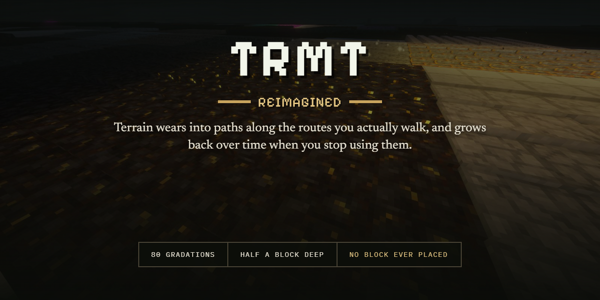
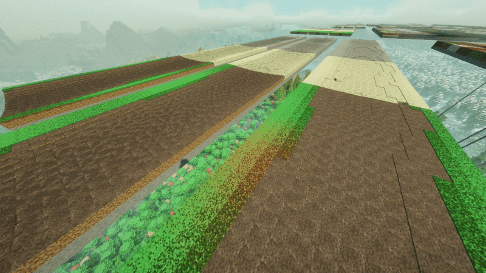

# TRMT Reimagined



Minecraft **1.7.10**, **1.12.2** and **1.16.5** — on Forge, and on Fabric for 1.16.5. It runs on a
plain loader with nothing else installed, except that 1.16.5 wants Cloth Config for its settings
screen. The 1.7.10 edition is built against **GT: New Horizons 2.8.4**.

**One mod, one version number, three editions.** They do the same thing, by the same numbers, and
they read the same settings file, so a pack can move between Minecraft versions and find its edits
where it left them. Twenty-eight classes are shared between them byte for byte. Where an edition
cannot match the others, it is because the Minecraft version took away what the behaviour was built
on, and the section it belongs to says so plainly rather than leaving you to find out. Those
differences are collected in [`docs/COMPATIBILITY.md`](docs/COMPATIBILITY.md) as well, if you would
rather see them all at once.

Inspired by — and derived from — **[The Roads More Travelled](https://github.com/milkucha/trmt)**
by *milkucha*, licensed CC BY-NC 4.0. This version by **Xep**. Unofficial: not produced,
endorsed or supported by milkucha. See [`LICENSE.md`](LICENSE.md) and
[`ATTRIBUTION.md`](ATTRIBUTION.md).

**Downloads** — [CurseForge](https://www.curseforge.com/minecraft/mc-mods/trmt-reimagined) or [Modrinth](https://modrinth.com/mod/trmtr).
**Source** — [GitHub](https://github.com/Xeptix/TRMTR), where bug reports and feature requests belong; a version's own notes are
in [`CHANGELOG.md`](CHANGELOG.md).

The mod is free and always will be. If you would like to put something in the hat:

[](https://ko-fi.com/F6L1285ROA)

---

## Contents

- [What it is](#what-it-is)
- [Install](#install)
- [How a path forms](#how-a-path-forms)
- [What you actually see](#what-you-actually-see)
- [Wear textures built from each block's own pixels](#wear-textures-built-from-each-blocks-own-pixels)
- [Cost curves](#cost-curves)
- [Physical sinking](#physical-sinking)
- [Wearing through into other surfaces](#wearing-through-into-other-surfaces)
- [Slabs, stairs and layered blocks](#slabs-stairs-and-layered-blocks)
- [Healing](#healing)
- [Weather](#weather)
- [Snow cover](#snow-cover)
- [Bone meal](#bone-meal)
- [What a route does to what is standing in it](#what-a-route-does-to-what-is-standing-in-it)
- [Which blocks erode](#which-blocks-erode)
- [Surface families](#surface-families)
- [Made ground](#made-ground)
- [Tampers](#tampers)
- [Reinforcement, warding and path light](#reinforcement-warding-and-path-light)
- [The Golem of Ways](#the-golem-of-ways)
- [Draughts](#draughts)
- [Books, achievements, quests and trophies](#books-achievements-quests-and-trophies)
- [Maps](#maps)
- [Waila and Hwyla](#waila-and-hwyla)
- [Tuning](#tuning)
- [Presets](#presets)
- [The config screen](#the-config-screen)
- [The wear table](#the-wear-table)
- [Commands](#commands)
- [Pinning a position](#pinning-a-position)
- [Servers](#servers)
- [Performance](#performance)
- [Optional integrations](#optional-integrations)
- [How this differs from The Roads More Travelled](#how-this-differs-from-the-roads-more-travelled)
- [Upgrading](#upgrading)
- [Removing the mod](#removing-the-mod)
- [Building](#building)
- [Licence](#licence)

---

## What it is

The idea comes from milkucha's mod: a world where the routes people take show it. Walk the same
line between your base and the mine a few hundred times and the turf scuffs, thins, goes bald,
and finally sinks into a rut. Stop walking it and it comes back.

This is that idea rebuilt from the ground up, for a pack with hundreds of mods in
it. The rebuild changed one thing that changes everything else: **no block is ever written into
the world**. The server keeps a compact wear record per chunk, and your client paints cosmetic
blocks over its own copy of the terrain. Everything unusual about this version follows from
that — it is removable, per-player switchable, server-switchable, and invisible in a world
opened without it.

Around that core the mod has grown a set of tools for shaping ground deliberately rather than
only walking it in: hand tampers, a chunk tamper, three enchantments that unlock extra modes, and
a golem that will hold a stretch of road at a wear level you choose while you are elsewhere.

## Install

Drop the jar for your Minecraft version and loader — `trmtr-1.7.10-<version>-forge.jar`,
`trmtr-1.12.2-<version>-forge.jar`, or `trmtr-1.16.5-<version>-forge.jar` / `-fabric.jar` — into
your pack's `mods` folder, on **both** the client and the server. That is the only file you need; the
`-dev` and `-sources` jars are for development.

**Requirements, 1.7.10**

- Minecraft 1.7.10 with Forge 10.13.4.1614 or newer.
- **[UniMixins](https://github.com/LegacyModdingMC/UniMixins)**, or the older
  **[GTNHMixins](https://github.com/GTNH-Museum/GTNHMixins)** that it supersedes —
  archived at the end of 2024, still working, and still what GT: New Horizons ships, so a pack that
  already has either one needs nothing. The jar's manifest asks for the Mixin tweaker, and three
  client mixins use MixinExtras, which UniMixins bundles. Nothing in the jar declares this as a
  Forge dependency, so if you are assembling a pack by hand this is the one thing to remember.

**Requirements, 1.12.2**

- Minecraft 1.12.2 with Forge 14.23.5.2847 or newer.
- **[MixinBooter](https://github.com/CleanroomMC/MixinBooter).** The jar's manifest declares its mixin config the way MixinBooter documents, and
  the mod declares `required-after:mixinbooter`, so a pack without it is told at the loading screen
  rather than left to wonder why. **UniMixins** states partial 1.12.2 support and is expected to read
  the same manifest attribute, but nobody has run this jar under it, so it is not claimed — and with
  the dependency declared it would have to be installed alongside rather than instead.

**Requirements, 1.16.5**

- Minecraft 1.16.5 with Forge 36.2.34 or newer, **or** Fabric Loader 0.14 or newer.
- **[Cloth Config](https://github.com/shedaniel/cloth-config)**, on either loader.
  Forge's own config screen was removed after 1.12.2 and vanilla has never had one, so this is what
  the settings screen is built on — the one dependency this mod takes that is not a loader. The jar
  declares it, so a pack without it is told rather than left to find out by pressing Config.
- On Fabric, **[Fabric API](https://github.com/FabricMC/fabric-api)** as well, and **[Mod Menu](https://github.com/TerraformersMC/ModMenu)** if you want to reach the settings
  screen in game: Fabric has no mod list with a Config button of its own. Without Mod Menu the
  settings file and `/trmt reload` still work.

Nothing else is required. Every integration listed under
[Optional integrations](#optional-integrations) is behind a mod-loaded check and the whole mod
works with none of them present.

A client with the mod can join a server that does not have it. The other way round is not
possible: a server with the mod has registered its blocks and items, so a server running it needs it
on every client. On the Forge editions that is enforced for you, and the client is refused before it
reaches a world. See [Servers](#servers) for what a visit actually looks like.

## How a path forms

Every couple of ticks the server samples what each player, each mounted player and each
configured mob is standing on. If that block is a surface it recognises, the position picks up
wear. When wear passes a threshold drawn at random for that position — the draw is what keeps a
path's edges ragged rather than geometric — the position advances one step along its family's
**wear chain**.

A chain is the whole run a surface takes from untouched to as worn as it gets, and every step on
it is a family, a visual gradation and a depth:

- **Sixteen gradations on the face as it stands.** This is the part people watch — a track
  appearing in turf — so it gets the detail.
- Then the ground **drops one pixel** and a shorter run of **eight gradations** starts on the
  freshly exposed material.
- That repeats down to **eight pixels, half a block**, which is where most families ship.

**Eighty steps, end to end**, for a family that sinks eight pixels. Dirt's is seventy-nine,
because its first surface gradation is skipped on real dirt — a dirt block already looks like the
first step of its own run. Ice's is forty-eight, because ice only sinks four pixels.

Grass never sinks as grass — it loses its cover first, and the hollowing out happens once the
chain has carried on into the earth underneath, so a grass path runs the full sequence from fresh
turf to a deep rut in bare earth.

A crossing does not only mark the square underfoot. It bleeds a fifth of its wear onto the block
ahead and half of it onto each flanking block, which is what gives a path width and a soft edge
rather than a one-block line.

Sneaking adds no wear, so you can cross a lawn without scarring it. Loose mobs never wear ground
at all: only players, mounts, anything on a lead, and mobs you name explicitly, and the shipped
list is villagers alone.

A blast scuffs the ring of ground around it that it did not destroy, falling off with distance,
so a crater does not read as a hole somebody cut out of clean terrain. Something landing hard
marks the patch it lands on the same way at a much smaller scale.

## What you actually see

The server never changes the block. Instead it tells your client which positions are worn and
how far, and your client writes a **ghost block** over its own copy of the world at each one.

**How many ghosts there are is the largest difference between the editions**, and it is a
consequence of how each Minecraft version decides what a block looks like.

On **1.7.10** a block's appearance is a metadata value and an icon per side, so there are
**sixty-six** ghosts. That is not sixty-six pictures — it is one block class per shape and per
rendering path the covered block might need: a base and a hollowed-out variant per surface family,
stair-shaped variants, three grass variants for the different ways a grass block's sides get shaded,
a solid stand-in for ice, and a see-through "window" twin of every one of those for showing the
layers inside a rut.

On **1.12.2** appearance is a blockstate and a baked model, and the model is handed the position and
works the rest out — so **one** class carries every shape and every gradation.

Either way none of them has an item form; there is no way to obtain or place one, and none is ever
written into the saved world.

A ghost mirrors the block it is covering wherever anything but rendering can tell:

- middle-click gives you the real block;
- mining hardness is the real block's, so nothing breaks early and snaps back;
- Waila, or Hwyla on 1.12.2, names the real block and offers the right tool;
- under **Angelica/Iris** on 1.7.10, and **Oculus** on 1.12.2, it inherits the covered block's
  shader material, so a worn granite road is still granite to your shader pack — and becomes the
  earth it has worn into once it is granite no longer;
- it goes on scattering the covered block's ambient particles;
- it goes on doing whatever the covered block does to something standing inside it, so **Chisel**'s
  cloud still breaks a fall when it is worn;
- snow and carpet lying on it come down with it as it sinks;
- on **1.12.2**, every map draws the colour of the real block, per position — see [Maps](#maps).

Those are each their own `client` setting and all of them ship on.

**Shader-material inheritance reaches a different mod on each edition.** 1.7.10 calls a pair of
methods Angelica added for exactly this purpose; no Iris and no Oculus has that pair. What it is a
convenience for does exist in all of them, one step further in - the holder a block's resolved shader
id is left on for the shader mod's own vertex writer to read - and that is where the 1.12.2 and
1.16.5 editions say a ghost is something else. Either way `client.inheritShaderMaterial` wants a shader loader of
the Iris family, does nothing without one or without a shader pack loaded, and names itself in the
log when it is going to do anything.

A block placed directly on worn ground stops the ground dipping under it
(`general.hideWearUnderBlocks`, on by default). What that means is decided by
`general.flattenWearUnderBlocks`, also on: the square keeps the texture of the wear it has and
fills its own cube again, so a path that runs under a floor still reads as a path and only the
hollow goes. Turn that second one off and the wear is not drawn at all and the plain block shows
through. Either way the record is untouched and comes straight back when the block on top is
broken — paving over a path is a way to stop tripping in it, not a way to repair it. Both settings
are yours alone despite sitting under `general`; nothing ever sends either of them to a client.

Writes go into the client world with no neighbour notification and no per-block render update —
each chunk gets one range invalidation instead — and the queue is drained against a per-tick
budget, because flying into a well-travelled area can queue thousands of positions at once.
Overlays further out than `client.overlayDistanceChunks` (twelve by default) are not painted at
all, independent of render distance.

Rotation is a pure function of the horizontal coordinates: four rotations of the same texture
scattered across neighbouring blocks, so a path reads as organic wear rather than a repeating
tile. Nothing is stored and nothing is sent — both sides derive the same answer.

## Wear textures built from each block's own pixels

Upstream ships one finished texture per stage, drawn against vanilla grass, dirt and sand. That
is exactly right for vanilla and exactly wrong for a pack with a dozen kinds of each.

So the authored art is **decomposed rather than drawn**. The grass art becomes a per-pixel
coverage sequence — which pixel of turf survives longest — that can be cut into any number of
gradations, and that sequence is then re-applied to whatever block is actually being worn.

The result: a Biomes O' Plenty grass wears into Biomes O' Plenty earth, red sand wears red,
GregTech stone wears grey, and a resource pack that retextures dirt changes worn ground for free.

Every other look is fully procedural, worked from the block's own pixels with no art behind it at
all, so all of them are safe on a block nobody ever drew wear for. There are **eleven**:

| Look | What it does |
|---|---|
| `grass` | takes the cover off in patches and lets the face underneath show through |
| `dirt` | rubs a growing patch of the surface away — what a trodden path is |
| `dirt_lite` | a narrower, shallower rub, leaving three fifths of the face untouched |
| `crack` | dulls a surface and splits it along a generated fracture network |
| `crack_lite` | the same run stopped a little over halfway, so a face grimes and hairlines without breaking up |
| `smooth` | flattens the face toward its own average colour and darkens it |
| `smooth_heavy` | the same, taking rather more of the relief with it |
| `smooth_crack` | buffed flat, then cracked |
| `smooth_dirt` | buffed flat, then trodden across |
| `crack_dirt` | cracked, then trodden — the fracture network survives under the track |
| `crack_dirt_lite` | that same run stopped early |

The compounds run in the order their ids name, and the order was measured rather than chosen: a
crack run last blurs a track's edge away to a quarter of what it was, while a track worn last
leaves two fifths of the face carrying the fracture network pixel for pixel.

Two ids that were looks once are not in that table and are still read: a family set to `sand` or to
`polish` lands on the rub, so an older config file goes on working rather than being refused.

Which look a family uses is config, and [the wear table](#the-wear-table) draws every one of them
on your own blocks before you pick.

How finely the run is drawn is also yours. `client.wearGradations` defaults to **eighty** —
one distinct picture per step of the chain, so no two consecutive steps look the same — and can
be taken down to sixteen, where consecutive steps share a picture five ways.
`client.wearRotations` defaults to four. The block atlas is measured at every stitch and the wear
textures are planned into the room it actually has, so a very large pack, or one drawn at
thirty-two pixels, gets a coarser ramp first, never below sixteen gradations, and past that the
faces last in registry-name order wear their family's generic art rather than their own; the log
says which, every stitch. `client.maxWearSprites` can only ask for less than that room, and at its
default it never does; set below what the family fallbacks alone come to, several thousand sprites
at the default gradations and rotations, it leaves every face on its family's generic art.

The sprites are generated at the one moment every block's own pixels exist — after the texture
atlas has loaded everything and before it starts throwing pixel data away. Changing stage counts,
looks or texture settings triggers that rebuild for you; there is nothing to press.

The tables the wear is filed in are keyed by the block itself rather than by its id, because Forge
renumbers modded blocks when a world is loaded or a server joined and a table filed under the old
numbering would draw one block's wear with another's pictures.

## Cost curves

The price of a gradation is not the same all the way along a run. Each family names a
**cost curve** that decides where along its own chain the traffic is spent:

| Curve | Shape | Families that ship with it |
|---|---|---|
| `flat` | the hundredth scuff costs what the first did | cobble, stone, netherrack, end stone |
| `sod` | turf tears at a touch; the earth beneath does not | grass, dirt |
| `settle` | displaces under the first passes, then settles into a shape it will not give up | sand, gravel |
| `pack` | one footfall in fresh powder is a whole gradation; packed snow is four times dearer | snow |
| `glaze` | climbs in a straight line the whole way and never levels off | ice |

Every curve is **normalised against the family's own gradation count**, so the total a run costs
never moves — only where along the run the cost sits. Snow's first gradation is eight tenths of a
crossing and its last is three and a third; ice's first is four crossings and its last is
forty-eight. Both average out to exactly the figure in the family table.

## Physical sinking

Later stages do not just discolour, they hollow out. `general.physicalDecay` picks how far that
goes:

- **`real`** (default) — ruts you can walk down into. The only mode where the ground you see and
  the ground you stand on are the same thing.
- **`visual`** — ruts you can see but not feel. You stand a little above the deepest of them.
- **`off`** — flat wear only.

`real` is the only place the mod touches collision, and the reason is worth stating plainly.
Everywhere else a worn position is a lie the client tells itself. But the ground you stand on is
the server's business, and at a worn position the server still holds ordinary full-height grass.
So `real` mixes into `Block.addCollisionBoxesToList` to answer for a shape it never placed.

That method is the busiest in the game — collision runs for every moving entity, every tick,
across every block its box sweeps — so the cost of *not* being worn ground is what matters. It
is a static boolean and a flag stamped onto the block instance when surfaces were resolved. Only
a block from a family that can sink ever reaches a position lookup.

Half a block is where most families ship, and it is not an arbitrary number: two engine limits
sit exactly there. A player's step height is 0.5, so climbing out of a rut that deep works with
no margin at all and a ninth pixel cannot be climbed out of; and mob path-following rounds an
entity's height to a node by adding a half and truncating, so one sixteenth deeper and mobs
truncate their path every tick. A family can be set as deep as **fifteen** — the record holds the
depth in four bits and one of the sixteen values is *flat* — but past eight what you are building
is a pit rather than a road, and that should be a decision rather than an accident. Ice ships at
four, because a scuff on ice is not a hole; grass at nought, because it sinks through dirt.

Two consequences of `real`:

- **Every client is shown the ruts and cannot switch the overlay off while connected.** A player
  with it off would be tripping over dips they never drew. Their own preference is left alone
  and comes back the moment they disconnect.
- Both sides work a rut's depth out from the wear stage rather than sending it per block, so
  they have to agree on the numbers behind that. The server sends its own geometry and pricing on
  connect and the client rebuilds against it — see [Servers](#servers).

If the mixin ever fails to apply, the server drops itself to `visual` and says so in the log,
rather than letting clients predict a floor the server disagrees with.

## Wearing through into other surfaces

A family names what it exposes as it sinks, in `families.<name>.wearsThroughTo`. Grass shows the
earth under it; stone shows broken stone, then the grit that comes off it, then the ground it was
laid on; cobble shows gravel and then dirt; gravel shows dirt.

All of that waits on `general.wearThroughToOtherSurfaces`, which ships **off**, so out of the box
every surface but turf hollows out as more of itself and the lists above sit ready rather than in
use. Turf is the exception because it has no choice: it is a face rather than a substance, with no
depth of its own to sink into, so the earth beneath it is the only rut it can have — which is why
it answers to `general.grassWearsThroughToDirt` instead, and why that one ships on. Turning the
wholesale switch on costs nothing in steps or in price; a run is the same length either way and
each step costs the same, so it changes what a rut looks like on the way down and nothing else.

The pixels of depth are shared out between the families in that list, earliest first. This
changes only what a rut **looks like** as it deepens — never how many steps it takes to get
there, and never what any of them costs. A family whose chain never leaves home simply wears
deeper into itself.

`general.wearPaceFollowsTheGround` decides whose prices apply once a chain has carried into
another family's material: on by default, which means a stone road is priced as stone the whole
way down rather than getting cheaper as it exposes gravel.

## Slabs, stairs and layered blocks

A **slab** walks the same chain at the same prices, with its rut drawn half as deep. A **stair**
shows every gradation of its wear in its face and none of it underfoot: a stair states its own
shape and never has a height clamped onto it. Both are found by detection and both have their own
per-family switch (`families.<name>.slabs`, `.stairs`).

With **Chisel** installed, a layered block gets its carved shell lifted clear of the layer drawn
inside it, so lavastone and waterstone do not flicker, and the liquid layer is painted into the
worn texture rather than leaving a grey block full of holes.

## Healing

Every record stores the absolute world time it was last walked on, so recovery is a function of
elapsed time rather than of ticks spent loaded. When a chunk loads, whatever recovery it missed
is applied in one pass — a chunk nobody has been near for two in-game months heals exactly as if
it had been loaded the whole time, and costs nothing while it is away. That is what makes
healing affordable on a world where most explored chunks are unloaded at any moment.

The clock is in-game time, so leaving the server switched off for a week repairs nothing. It is
also **held still whenever no player is connected** (`healing.pauseWhenEmpty`, on by
default), so a road does not grow back overnight through hours nobody was there for. Golems are
deliberately exempt from that pause: a golem set to hold a road is doing work, and work should
not be free.

Each family owns its recovery outright — see [the family table](#surface-families) — rather than
deriving it from what the family cost to wear. `healing.healingRate` scales all of them at once.

## Weather

Rain is a **recovery discount**, not a gate. Turf, earth, sand and gravel mend twice as fast
while precipitation is actually falling on them (`families.<name>.wetRecoverySpeed`, 2.0 for
those four and 1.0 for everything made of stone). Anything under 1.0 is read as 1.0, so this can
speed recovery up and never slow it down, and covered ground simply mends at the ordinary rate.

There is also an opt-in gate. `families.<name>.healsOnlyWhenWet` — **off for every family as
shipped** — makes a surface bank its elapsed recovery and pay it out only while it is actually
raining or snowing on that spot, metered at a gradation every few seconds so a downpour catches a
road up rather than repairing it instantly. The `weather` category decides what counts as wet:
whether open sky is required, whether dry biomes ever mend, and whether the Nether and the End —
where nothing falls at all — are excluded from the rule rather than frozen for ever by it.

The whole feature is off until somebody turns a family's switch on, and every sub-rule has its own
toggle.

## Snow cover

**On by default.** Snow lying on ground takes the traffic first: a layer absorbs the wear and is
trodden away before the ground beneath starts to mark, and a half-trodden track fills back in
after about a day of snowfall.

This is the one part of the weather work that destroys real blocks — a snow layer trodden through
is genuinely removed — so it is listed again under [Removing the mod](#removing-the-mod).

## Bone meal

**Bone meal mends worn ground.** Deliberately unevenly: the patch it reaches is a random size up
to `bonemealRadius`, with the corners dropped as it grows so the mend comes out roughly round,
and each square in it rolls its own repair amount from one gradation up to `bonemealMaxSteps`.
A fixed one-block, one-step repair meant standing on each square in turn and the result was as
square as the effort; a few scattered handfuls tidy a junction without anyone counting blocks.

Mending also **costs a block of each kind of ground it mends** (`general.bonemealCostsABlock`, on
by default) — you are filling a rut in, and the material has to come from somewhere. It is taken
from anywhere in your inventory, once for each kind of ground in the patch: a handful across a
grass verge and a cobble road costs a block for the grass and one for the cobble, and a square
whose ground you are carrying nothing for is left as it was, and chat says so whenever the handful
mended something or was aimed at worn ground.
`families.<name>.repairBlocks` is what lets a grass path or a turf road be paid for with ordinary
dirt rather than demanding the exact block; `healing.repairAnyInFamily` widens that to any block
of the family. Creative mode pays nothing.

The bone meal is only spent on mending if something was actually repaired. A handful that mends
nothing goes on to do whatever it would have done anyway, so it still behaves normally on crops
and saplings standing on worn ground — and on grass it still grows grass, even beside a rut you
had nothing to fill.

## What a route does to what is standing in it

Six separate settings, and they do not all ship the same way:

| Setting | Default | What it does |
|---|---|---|
| `trampling.vegetation` | **off** | crossing the same plant often enough breaks it; the count fades, so only a busy route does |
| `trampling.leaves` | **off** | walking on the same leaf often enough breaks it — a route over a canopy or a leaf bridge thins away |
| `trampling.groundCover` | on | a plant standing on a square comes down with it when the ground drops a level |
| `trampling.groundCoverHolds` | on | except saplings and flowers, which hold their square just short of dropping |
| `trampling.groundCoverOnSink` | on | plants come off a square only when it drops a level, not at every gradation it wears |
| `trampling.groundWearsAway` | on | a square worn a full threshold past the end of its chain is removed, dropping nothing |

Both trampling switches keep a count against each plant or leaf that fades at
`healing.wearDecayPerDay`. A reinforcement or a ward on the block refuses them, a plant in tilled
soil is spared unless `trampling.groundCoverOnTilled` is on, and a slab or a carpet laid on a leaf
takes the traffic.

`groundWearsAway` is the mod's most destructive default. A pin, a reinforcement, a ward or a path
light each refuse it, so anything you have deliberately marked is safe from it.

## Which blocks erode

Naming every erodable block in a config would go stale the moment the pack updated, so the mod
walks the block registry at startup and classifies by what a block **is** — superclass, material,
and a name check to keep the material rule from swallowing near-misses like farmland, sandstone
and soul sand. Detection is identical on client and server and touches no client-only API. What a
client concludes for itself is only the starting point, though: a server names the fingerprint of
the table it is actually using, and a client whose own table differs asks for it and uses the
server's for the visit, so two machines that classify a modded block differently do not end up
drawing two different worlds. It is dropped on disconnect like every other server-owned figure —
see [Servers](#servers).

What it found is written back into `families.<name>.blocks`, so that list doubles as a record of
what is actually being affected rather than a black box. Anything you add by hand is kept. To
freeze the list, turn `surfaces.autoDetect` off and edit by hand — with detection on, deleting an
entry does nothing because it gets put straight back. To drop a single block while leaving
detection running, put it in `surfaces.exclude`, which always wins.

`/trmt surfaces` reports what it found.

## Surface families

Twelve families. Ten of them wear; leaves and vegetation exist only as trampling targets and are
never staged or priced.

| Family | Look | Curve | Wear per gradation | Crossings per gradation | Crossings, end to end | Sinks to | In-game days to recover fully |
|---|---|---|---|---|---|---|---|
| `snow` | `crack_dirt_lite` | `pack` | 0.8 – 1.6 | 2.4 | 192 | 8px | **6** |
| `sand` | `smooth_dirt` | `settle` | 1.2 – 2.4 | 3.6 | 288 | 8px | **30** |
| `gravel` | `dirt` | `settle` | 1.4 – 2.8 | 4.2 | 336 | 8px | **45** |
| `ice` | `crack_dirt` | `glaze` | 10 – 16 | 26 | 1,248 | 4px | **31** |
| `dirt` | `dirt` | `sod` | 8 – 12 | 20 | 1,580 | 8px | **100** |
| `grass` | `grass` | `sod` | 8 – 16 | 24 | 1,920 | via dirt | **125** |
| `cobble` | `crack_dirt` | `flat` | 12.5 – 20 | 32.5 | 2,600 | 8px | **170** |
| `stone` | `crack` | `flat` | 25 – 40 | 65 | 5,200 | 8px | **320** |
| `nether` | `smooth_crack` | `flat` | 25 – 40 | 65 | 5,200 | 8px | **400** |
| `end` | `smooth_crack` | `flat` | 25 – 40 | 65 | 5,200 | 8px | **400** |
| `leaves`, `vegetation` | — | — | — | — | — | — | trampling only |

**Wear per gradation** is the random threshold drawn per position. **Crossings per gradation** is
what that works out to for a player on foot at the shipped multipliers, averaged across the whole
run — a mount halves every one of these, and the cost curve moves where along the run the cost
sits without changing the average. **End to end** is a whole chain, from untouched ground to as
worn as it gets.

An in-game day is twenty real minutes, so 100 in-game days is about thirty-three hours of play.

Two of these numbers are worth reading against each other. Snow at six days and end stone at four
hundred is a sixty-seven-fold spread inside one mod, and it is deliberate: snow is the only
surface in the game that gets **replaced from above**, and ice the only one that **re-forms
itself**, while nothing whatever falls on a road in the Nether or the End. That last is also why
those two recover a quarter slower than stone despite wearing at exactly stone's rate — every
overworld surface is mended by weather and neither of those places has any.

Each family has its own config section: on/off, whether detection may fill it, its block list,
slabs and stairs, gradation count, thresholds, cost curve, healing rate, wet-recovery speed and
wet gate, wear look and strength, sink depth, layers per pixel, what it wears through to, what may
pay to repair it, its resistant blocks and their multiplier, and a ceiling on how far along its run
it may go at all. Where a family starts to sink is not among them: a run lays its gradations on the
face first and every step after them sinks, so the old `sinkStartFraction` had nothing left to move
and is taken out of the file rather than left promising something it cannot do. A `maxSinkPixels`
of nought is what stops a family sinking.

`general.maxWearFraction` and `families.<name>.maxWear` cap that last one — whichever is lower
wins. Set to 0.25 and everything stops about where a path reads as a path and never hollows out.

## Made ground

**Tilled soil never erodes.** A field somebody hoed should stay a field, so farmland is excluded
outright — it is not a full block anyway, which detection already rejects.

**Grass paths do erode, but slowly.** A path is made ground: somebody wore it in on purpose, so
it should stand up to traffic rather than be immune to it. Path blocks sit in the dirt family
with `families.dirt.resistance` applied — eight times the wear before a gradation advances, and
no change at all to how fast they recover. The list is `families.dirt.resistantBlocks`, and the
same mechanism works for any block you want to toughen.

## Tampers

The mod's main item: a hand tool for shaping worn ground directly instead of walking it in.

- **Left-click** wears one gradation in. **Sneak + left-click** mends one.
- **Right-click** mends a patch out to the tool's reach.
- **Sneak + right-click** pins the square, or lets it go.

Mending fills the rut with what the ground is made of, taken from your inventory once the
gradation has gone back: what the ground drops for the hand tamper (earth for grass, cobble for
stone), or a block of the ground itself or anything the family's `repairBlocks` names for bone
meal and the chunk tamper. A patch or area over mixed ground pays for each kind separately and
leaves alone any kind you are not carrying. Wearing costs nothing but the tool's durability.
Mending that costs material earns a little experience (`healing.xpFromHealing`); mending that
costs nothing — creative, a cost set to 0, the Wayfarer's Tamper — earns none, so wearing a
square in and mending it out again is never a farm.

Tampers come in **grades**, and the grades are read from config
(`general.tamperGrades`) as `name:oreName:uses[:reach]` entries rather than hard-coded — so a pack
can add its own. The shipped list has **forty-three entries**: iron, gold, diamond and netherite at
512, 256, 2048 and 4096 uses, and thirty-nine GregTech and Thermal metals besides, from tin at 300
to neutronium at 32,767. The number rather than the metals is the point, because anything the pack
has no ingot for is simply skipped — and the grade the Wayfarer falls back on where neither
netherite nor diamond can be made is whichever has the most uses written against it, which on the
shipped list means neutronium wherever the pack registers its ingot.
Each is crafted from the ore-dictionary name its entry gives, so any pack's ingot or plate works.

A **Chunk Tamper** does the same to a whole cube of ground at once, with the area and the
gradations per use both adjustable in-world (right-click air to resize, sneak + right-click air
for depth, ctrl + right-click for its settings screen). It is priced per gradation mended, one
block for every `general.chunkTamperGradationsPerBlock` (four by default), each kind of ground
paying its own — so it costs as much as it puts back, about a quarter of what the hand tamper's
single-square mend would charge for the same gradations. A figure set under an
earlier name for that key is carried across as the file is read rather than quietly reset, so a pack
that tuned it keeps its tuning.

The **Wayfarer's Tamper** is the top of the family: works any ground for nothing, and never wears
down. It is built around a chunk tamper with a nether star above it - netherite where
`integration.gtnhEnhanced` is on and a netherite chunk tamper can be made, diamond where one can,
and on a grade list that makes neither, the grade with the most uses written against it - so the
only lists that leave it uncraftable are ones that make no chunk tamper at all — that, or a pack
with nothing registered as `blockDiamond`, which the log says at startup. The choice is made
once, as the game starts.

## Reinforcement, warding and path light

Three enchantments, each of which unlocks a mode on a chunk tamper or a Wayfarer's Tamper. Each
has a single level, and each costs a material to apply to a block and can be taken off again.

- **Reinforce** — three levels, stored on the record itself. A reinforced block resists blasts,
  the third level proof against anything, and the same reinforcement hardens the ground against
  feet: each level adds another whole lifetime of traffic, so a road at the third level takes
  four times the walking to wear through.
- **Spawn ward** — nothing spawns on a warded block. Hostiles and passives are barred separately,
  so a paddock can keep its animals and still refuse everything that comes out of the dark. The
  ward belongs to the block, so it holds exactly where it was put and nowhere else.
- **Path light** — ground that glows, in graded levels and a chosen colour, without placing a
  light source in the world.

Waila, or Hwyla, reports all three - reinforcement and wards on any block, worn or not, and light on the worn
ground that carries it - and each of them refuses `trampling.groundWearsAway` on the square it is
applied to.

Each comes as a book: crafted, found in a stronghold library or a dungeon chest, rolled onto a plain
book at an enchanting table, or bought from a librarian. Each feature has its own switch —
`reinforce.enabled`, `spawnward.enabled` and `pathlight.enabled`. With one off, its enchantment keeps
its id, so a tool already carrying it is not left with a broken one, but the mode does nothing and no
new book of it is handed out: tables and librarians stop at once, and from the next start its recipe,
chest finds, achievements, trophy and quest drop out rather than offering a lesson nobody can use.
Nothing already made is taken back: a book in a chest or a librarian's trade already rolled stays,
and it will not go onto a tool while its switch is off, except in creative mode.

## The Golem of Ways

Built in the world the way an iron golem is. A golem holds a stretch of ground at a wear level
you choose — wearing it in or mending it back — so a road you want kept at half-worn stays there
whether or not anybody walks it.

It has an inventory screen, spends tools and material out of it, and takes **upgrades**: range,
speed, sparing, frugal, deep, green, stout, fierce, settled, and an omni part that carries the
set. Fitted parts change what it can reach and what it costs to run.

That last part is really a pair rather than one. Binding all nine together makes an **Unstable
All Ways**, which carries the whole set and wears three to nine of them at a time, choosing again
every minute — with its storage always among them, so nothing it is carrying can be stranded by the
roll — and a nether star settles that into the plain All Ways afterwards. `golem.unstableOmni`, on
as shipped, is what decides whether the unstable step exists at all; off, the nine craft straight
to the settled part and anything already holding an unstable one goes on working.

Mending costs it **twice what the same work costs you** with a plain tamper or a chunk tamper, as
it comes. It is priced the chunk tamper's way: `golem.blockCost` (2) blocks for every
`general.chunkTamperGradationsPerBlock` (4) gradations of one kind of ground, each kind rounded up
on its own once a stroke. A golem working a chunk tamper or the Wayfarer's therefore spends two
blocks wherever your chunk tamper would spend one — 114 for a fifteen-by-fifteen layer one
gradation deep, where yours spends 57. Every stroke buys at least one whole purchase for each kind
of ground it mends, so a golem working a plain tamper, which puts back one gradation a stroke,
spends two blocks a gradation, twice your single-square mend; and ground any golem keeps up a
gradation or two at a time costs it close to that, whatever tamper it holds. Frugal Ways halves
`golem.blockCost`, rounding down and never below one, which at the defaults is parity. A golem is
never free: the Wayfarer's Tamper, and a chunk tamper with `general.bonemealCostsABlock` off, cost
you nothing and still cost a golem its blocks. What pays is bone meal's rule, not the hand tamper's
drop rule, taken from its own storage and then, with Settled Ways, from the containers round its
anchor. A golem that has asked those stores for a kind of ground they cannot pay for remembers the
refusal rather than walking the whole list again on every stroke; it tries that kind again when the
stores are next looked at — never more than ten seconds — or when its anchor moves or something is
put away. Ground nothing in reach pays for therefore costs it a pause rather than its whole round.

A hopper or a dropper may put in the ground it mends with and nothing else, and never into its last
empty slot, which the golem keeps for a tamper to replace one that breaks and for what its work
turns up. No hopper or hopper minecart can take anything out: tampers and the fitted upgrade come
out by hand, and whatever it has picked up comes out by hand or, with Settled Ways, as surplus it
puts away itself. That is enforced through the sided-inventory checks
vanilla's hoppers honour. A mod that moves items without asking them — taking a stack out directly,
or changing one in place — cannot be refused without also refusing the golem's own screen.

It will also **reinforce** ground: throw a bucket of concrete (or the pack's equivalent) into the
ground it keeps and it eats what its round carries it past, one at a time — chewing each with a
pose of its own and handing the empty bucket straight back — then takes a random block inside its
area up a level. It will not go and fetch a bucket thrown across the field, and it takes no bite
at all while nothing in its round wants reinforcing. It notices thrown material only while it is
picking things up, so `golem.pickUpDrops` off switches this off as well.

The whole golem is behind `golem.enabled`, and its upgrades behind `golem.upgrades`. With either
off, the achievements and quests that would ask for one quietly drop out rather than sitting on
the page unearnable.

## Draughts

- **Draught of Lightness** — you wear no ground at all while it is on you.
- **Draught of the Heavy Foot** — its opposite; you wear ground far faster.

The Lightness draught carries the original mod's own ingredients. Both are **mixed at a bench
rather than brewed in a stand**, and that is a constraint of both versions rather than a choice: there is no
brewing API, vanilla works out what may leave a stand from four bits of a damage value, and only
three of those sixteen patterns are unclaimed across a large pack — with no cheap way to tell
whether another mod has taken one, and no worse failure than quietly handing somebody the wrong
drink. The Heavy Foot is reversed out of the Lightness with a fermented spider eye, the way
vanilla reverses every other potion.

With GregTech present both get harder recipes: the Lightness wants an awkward potion, three
feathers, a ghast tear and the pack's lightest ore.

Both can be switched off individually or as a pair. If the potion ids they claim are ever taken
by something else, the mod strips the orphaned effect rather than letting a client crash on it.

## Books, achievements, quests and trophies

**Four guide books**, each with its own art and reading screen: an overview (Mk I), a technical
one (Mk II), a command reference, and a golem manual. They turn up in generated chests.

**Sixteen of them**: making each of the three tampers, using each enchanted mode and binding each
lesson into a book, standing a golem up and fitting All Ways, reading each book, and a completionist
entry for the whole shelf.

On **1.7.10** they are sixteen achievements on a page of their own. On **1.12.2** they are sixteen
advancements, because 1.12 removed the achievement system — this is the one place that edition
cannot be 1:1, and it is a change of mechanism rather than of content. They read the same translation
keys, so one set of translations serves both. One real consequence: a JSON file cannot be registered
conditionally, so every switch an achievement answered to is read where the advancement is granted
instead.

**BetterQuesting** and **Amazing Trophies** are integrated by writing their own JSON into their
own config folders — the mod links against neither, so both cost exactly nothing when absent. The
quest chapter is written additively into `DefaultQuests` and quests whose subject is switched off
are dropped, with anything that depended on them re-parented onto what is left, and the Wayfarer's
Tamper offered as the final prize carries only the enchantments the chapter still teaches.

**On 1.12.2 both file shapes are unverified.** They are the 1.7.10 edition's, and everything around
them is confirmed — the folders, the fingerprint of what was written, the guards that make each one
do nothing when its mod is absent — but nobody has checked either format against the 1.12.2 versions
of those two mods, and Amazing Trophies may not exist on that version at all. A file written there
is offered rather than accepted; a pack without those mods is unaffected either way.

**World-gen loot**: tools, books, draughts, golem parts and enchanted books can turn up in generated
chests, added additively, in any pack, GregTech or not. `loot.lootFinds` takes all of them out and a
weight of 0 takes out what that weight covers, which for three of them is a group:
`loot.enchantBook` covers all three unlock books, `loot.guideBookRare` the Mk II, Commands and Golem
guides, and `loot.golemUpgrade` every ordinary golem upgrade. A single unlock book goes only by
turning its enchantment off. All of these are read as the game starts.

**They are not as rare as they sound, and the measured figure is worth having**: this mod's
seventeen dungeon entries come to 35 against vanilla's 127 — about a fifth of what a dungeon chest
gives out — and 28 against 71 in a mineshaft. The same holds in every edition, whose chest pools are
the same size. Divide the weights by five if you want this to be a genuine rarity.

Separately, items can be handed to a player on arrival in a world — every one of those ships off.
Not on a fresh spawn but on any login where that player has never had that item *in this save*, so
turning one on reaches people already playing, and turning it off and on again hands out no seconds.

## Maps

**Worn ground is coloured per position from the real block underneath**, rather than every modded
dirt collapsing to one flat brown. Every edition does that, and they do it by completely different
means — which decides what each one can and cannot offer.

On **1.12.2 and 1.16.5** no map mod is named anywhere. A block is asked its colour with the position
in hand, so one override answers for every map at once: JourneyMap, Xaero's Minimap and anything
else that reads the world all get the same answer, and a worn path travels from green to earth as it
wears through because by then the square's appearance really is earth. There is nothing to switch off
when a map mod changes its internals, and nothing to go stale.

Those two editions also **darken a worn square**, to one colour. The palette a map draws with is
sixty-four fixed entries, so there is no fraction to dim by — but an entry can be picked for being
darker, and that is what `surfaces.mapWearDarkening` decides there: the nearest entry to the ground's
own colour darkened by that much. Grass at `#7fb238` is drawn as `#392923`. A square that shows any
wear at all is drawn in it and does not darken further, so **a road is visible on the map and how
worn it is is not**. Where a pack's ground has nothing darker in the palette worth picking it keeps
its colour, and the log says so once, by name.

On **1.7.10** a block is asked its colour with nothing but a metadata value: a worn square cannot
tell which position is being asked about, and can answer only from the family its class stands for.
So that edition carries three hundred and fifty-seven lines of reflection against JourneyMap's
internals and a hundred and nineteen more against Xaero's to achieve the same paragraph — and in
exchange it can do things 1.12.2 cannot, because it hands those mods a real RGB value rather than one
of vanilla's sixty-four fixed palette entries.

### What 1.7.10 can do with that, and the later editions cannot

With **JourneyMap** installed, two things happen to the colour:

- it **travels toward what the ground is becoming**, in step with how far along its chain the
  square has walked, so a turf path leaves green and arrives at earth instead of the map calling a
  bare dirt track a lawn all the way down;
- it **darkens** with wear, so a road reads as a road.

Both of those answer to `surfaces.mapTracksWear`, on as shipped. Off, a map draws every square as
the material it started as and the darkening a world-reading map gets through the tint goes with
it; the tint correction that stops a modded turf reading as a green stripe stays, because that is
not wear. How far a fully worn square darkens is `surfaces.mapWearDarkening`, 0.62 by default,
spread evenly over every gradation the ground has — about eight tenths of one per cent a step on a
family with eighty of them. The later editions read the same figure and can only pick a colour with
it, as above.

Optionally — `client.desirePathHighlight`, **off as shipped** — a worn square can also be pulled
toward a colour that is not a material at all, so routes stand out on the minimap. At a half the
material is still readable with the traffic laid over it; at one, worn ground is drawn entirely in
the highlight colour. The default colour is a violet, chosen for being a colour no ground in any
dimension is, and it stays separable for the common forms of colour blindness. It scales by the
square root of the wear rather than linearly, because the interesting case is a route somebody has
just started using.

All of it is reflective, so a JourneyMap that moves its internals falls back to the generic
colouring rather than crashing, and it says once in the log when it is genuinely running.

**Xaero's Minimap** has no colour hook of its own on 1.7.10: it reads the client's world and asks
each block for its tint. Worn ground answers that question with how far along its run it has
come, so a road darkens on the map as it wears (`client.mapWearThroughTint`), and because this
mod never sends a block packet - wear is painted into the client's own copy of the world - it
tells Xaero's directly that a chunk has changed, or the map would keep the square it first drew
for ever. Both are reflective and both switch themselves off if Xaero's has moved its internals.
Xaero's asks in its *Accurate* block-colour mode, which is its default, and in *Vanilla* mode only
when its own *Biomes in Vanilla Color Mode* is on as well. With both off it takes the block's map
colour and hands it back without asking anything about the position, so a path then shows only
where the ground has worn through into a different material.

**The vanilla map item never shows wear, in any edition.** It is drawn from the server's own blocks,
and no worn square exists there: this mod paints them into each client's copy of the world and writes
nothing into the save. Minimaps read the client's world, which is why they show the path.

**On 1.12.2 and 1.16.5, `client.desirePathHighlight` and `client.mapWearThroughTint` do nothing.**
Both are fractions of a colour, and a palette entry cannot be dimmed by a fraction — there is no
violet to reach toward and no tint to withhold. They are left in the settings file so a pack can move
between versions and find its edits where it left them, and the mod names any of them you have
changed, once, as it loads.

`/trmt mapcolour` lists what a map mod makes of every ghost on 1.7.10. On the later editions it tells
you what the square under your feet is drawn as, what the untouched ground beside it is drawn as, and
what a worn square there reports once it is darkened — three answers, because a map item and a
minimap are reading two different things.

## Waila and Hwyla

**Waila on 1.7.10; Hwyla on 1.12.2**, which is Waila's successor there. The integration is the same
one: same package, same four interfaces, and the mod id in lower case where it used to be
capitalised. Everything below is true of either.

If it is installed, looking at worn ground adds its gradation, how far it has come toward the next
one, whether it is pinned, when it starts growing back, how deep it has sunk in sixteenths, and its
path-light level and colour. Reinforcement and spawn wards show on any block they sit on, worn or not,
so a warded brick floor says so as plainly as a worn road: the level, whether it is blast-proof, and on
ground that wears, how many times over it holds out against traffic. Those lines come from the server a
moment after the crosshair lands, and go within a couple of seconds of being taken off. Nothing about
wear is reported on a block that shows none: a trampled leaf or plant keeps a tally of the crossings
that will break it, and ground walked on short of its first gradation keeps the wear toward it, and
neither is a gradation, so a reinforced or warded leaf shows its protection and nothing more. A glow
shows only on the worn ground that gives it off; ground that heals back to pristine keeps its glow for
when it wears again, and nothing is lit until it does. There is a second provider for the Golem of Ways.

The block itself already reports honestly without either — a ghost hands back the block it is
covering, so any tooltip names the real block and the right tool. Toggle the extra lines under
**TRMT Reimagined** in Waila's or Hwyla's own settings.

One thing worth knowing if the lines do not appear: Hwyla has a `keybind` setting of its own that
hides every mod's extra lines until a key is held. That is Hwyla's, not this mod's.

## Tuning

Everything lives in `config/trmtgtnh.cfg`, and there is an in-game screen for it — see below.
Three dials matter most, and all read the same way: **higher means faster**.

- `general.globalSpeed` — the whole mod at once. `2.0` forms paths twice as fast *and* recovers
  them twice as fast. Moves the pace without touching the balance, which is usually what you
  want when the mod as a whole feels too eager or too sleepy.
- `general.erosionSpeed` — wearing only. Defaults are about **eight times slower than upstream**,
  so `8.0` restores upstream's pace.
- `healing.healingRate` — recovery only.

Beyond those: who wears the ground (`multipliers` — players at 0.5, mounted at 2.0, anything on
a lead at 1.5, and a `mobs` list that defaults to villagers only), which dimensions and which Y
range are tracked, how far wear bleeds to the sides and ahead, bone meal reach and strength,
trampling, weather, snow cover, the golem, the tampers and their grades, loot, and the sweep and
sampling budgets under `performance`.

A line of `Name:0` in `mobs` keeps that mob off the ground while it walks loose, even under a `*`
line, because a named line outranks the wildcard; the Wayfarer's Tamper's *Stop this wearing the
ground* button writes it. A mob on a lead still wears while `fromLeashedMobs` is on, because that
counts anything being led.

`/trmt reload` re-reads the file from disk and re-runs detection without a restart.

## Presets

At the top of the config screen, above everything else, sit **five choosers**. Each covers one
axis and each has named rungs plus *custom*:

- **Quality** — client-side only. How much of your video memory the mod may spend on detail:
  gradation count, rotations, sprite budget, how many blocks get wear textures of their own, and
  whether any do. Nothing here changes how ground behaves, so it is safe to move on somebody
  else's server.
- **Wear** — how fast ground marks.
- **Healing** — how fast it comes back.
- **Phases** — how finely the chain is cut.
- **Depth** — how deep ruts go.

They are measured against the shipped defaults rather than against each other, so applying one
twice is applying it once, and each remembers the numbers you had before so going back to
*custom* returns them rather than leaving you on the preset's figures. Moving one axis leaves the
other four exactly where you put them.

Quality moves none of the settings for the layer drawn behind a worn block — the lava and water in
Chisel's lavastone and waterstone, under [layered blocks](#slabs-stairs-and-layered-blocks) — but
the lower rungs change that layer all the same. It is laid into every worn picture made from the
block's own pixels, one for each gradation at each rotation, so *low*, which asks for twenty-four
gradations at two rotations against the default's eighty at four, gives it under a sixth as many
pictures; the liquid's own frames are kept once for each face whatever the rung, so the memory it
holds falls a little less far than that. It does not make the layer cheaper to redraw.
`client.innerLayerUploadsPerTick` caps how many pictures are redrawn each time the liquid moves,
and on a client without a modern chunk builder Chisel's shipped blocks ask for more than the
shipped ceiling at *low* as well as at the default, so a lower rung lets a larger share of the
pictures move rather than redrawing fewer of them. *Low* also lowers the ceiling on how many blocks
get wear textures of their own, and a layered block past that ceiling, or turned away by
`client.maxWearSprites` or by the room in the block atlas, wears its family's generic art, which
has no layer in it. *Potato* turns per-surface textures off, so every worn block wears that generic
art and Chisel's lava and water neither show nor move on worn ground at all. *High* and *ultra*
move only that ceiling, which changes nothing about a layer on a pack with room to spare, and on a
pack without it draws every ramp more coarsely first. To keep the ramp and change only the layer,
the settings to move are `client.animateInnerLayers`, `client.innerLayerAnimationBudgetMb` and
`client.innerLayerUploadsPerTick`.

## The config screen

Reachable from the mods list. Presets come first, then the client category — the part a player on
someone else's server can actually change — then everything else.

The block lists — detected blocks, resistant blocks, exclusions — draw each entry with that
block's own icon beside it, and the mob list draws each mob's head, so you can see what you are
looking at instead of parsing registry names.

Two buttons sit on it that are worth knowing about:

- **Wear table** — see below.
- **Push to server** — offers your client's copy of the server-owned settings to a live server.
  The server checks that you are an operator, on its own thread, and writes only keys that already
  exist. So on a server you administer the non-client categories are editable in game, not merely
  shown for reference; in single-player all of it is.

The `client` category holds twenty-six settings of its own, from the three obvious ones (show worn
paths, overlay distance, per-surface textures) through the inheritance switches, the inner-layer
rendering budget, and the map highlight. Two settings just as personal sit under `general` instead
— `hideWearUnderBlocks` and `flattenWearUnderBlocks`, which are yours alone and are never sent to
anybody — and the config's own category comment says so where a reader will meet it.

## The wear table

An in-game screen that draws **all eleven looks on your own blocks**, at your own resolution,
before you pick one — because a look is a picture and no argument about one predicts what it will
do to snow.

Alongside the pictures it draws each family's numbers: what a gradation costs, what a whole run
costs, how long it takes to come back, and a bar showing where along the run the cost sits under
that family's curve.

The editor half stages changes and publishes them in one go, so you can move sink depth, phase
count, gradation cap, look, curve and preset together and see the whole result before committing
any of it.

Typing a figure takes its axis off any preset staged there, the way editing the file moves a
chooser to custom, and choosing a preset drops figures typed on its axis. Revert drops everything
staged for the family on screen and leaves the presets.

## Commands

All require permission level 2.

```
/trmt status
/trmt enable | disable
/trmt purge
/trmt reload
/trmt surfaces [family]
/trmt here
/trmt golem
/trmt showcase [radius]
/trmt demonstrate [NxN|NxNxN] [book|snake|radial] [y=<height>] [max=<count>|all]
                  [realdemo[=<w>x<l>]] [nogolems] [frozen] [warded[=h|p|h+p]] [reinforced[=0-3]]
                  [quick=<n>] [quicktp=<n>] [cleararea[=n]] [samearea[=x,z]]
                  [tight|nogap] [overwrite|force] [tp]
/trmt mapcolour
```

- **`status`** — enabled, healing, the three speed dials, physical decay mode, how much is
  stored, how many clients are subscribed, and which families are on.
- **`disable`** — stops accumulation and clears every client's overlay without touching a block.
  The data is kept, so `enable` brings it all back exactly as it was. **`purge`** is the one that
  actually discards anything.
- **`here`** — the wear record for the block you are standing on: what it detected as, the
  appearance, the gradation, wear against its threshold, and how many in-game days since it was
  last trodden. The quickest way to check the mod is doing anything.
- **`golem`** — why the golem in front of you is not eating what you have thrown at it: whether
  feeding is switched on at all, whether that golem has orders and a tamper, whether anything in
  its round still wants reinforcing, and what it has in its mouth. Then the item in your hand -
  what it actually is, whether any fluid registry knows it, what each entry of
  `reinforce.materials` resolves to, and the exact line to add when nothing there names it. A
  golem that is refusing and a golem that is working look almost the same from outside, and every
  one of the conditions it refuses on is silent; this is the one that says which.
- **`showcase [radius]`** — stripes every step of the chain across the ground around you, so the
  whole run can be seen side by side without walking a route two hundred times. Nothing is
  special-cased: it writes ordinary wear entries through the path traffic uses, heals away on the
  usual schedule, and `purge` clears it.
- **`demonstrate`** — builds an exhibit in the sky above you instead: one platform per *detected*
  surface, each stepping from untouched ground to fully worn, which is what you want when
  checking a change against every block at once rather than the handful that happen to be
  underfoot. The first square of each platform is left pristine deliberately, because the chain's
  own first step is already visible wear and there would otherwise be nothing to judge it
  against. `frozen` pins every square so it will not move; `warded` and `reinforced` stamp those
  states on for checking them; `tp` puts you up there.
- **`demonstrate ... realdemo`** — adds the two things a grid of platforms cannot show. Behind
  the exhibit, three stretches of road running turf through to stone with a rut that wanders and
  deepens, because whether a road reads as a road only shows over a distance. In front of it, one
  fenced pen per golem upgrade, each with worn ground in four materials, a chest of tools, a chest
  of material, and a golem stood up in it carrying a Wayfarer — so the whole crew can be watched
  working side by side, and the only difference between two pens is the part fitted. Re-running it
  kills the old golems and sweeps up what the old chests dropped rather than standing a second crew
  beside the first. `nogolems` leaves the pens out.
- **`mapcolour`** (`mapcolor` also works) — lists the ghost blocks and what a map mod makes of
  each, which is how the "worn sand draws as flat grey on the minimap" class of bug gets caught.

## Pinning a position

Any position can be **frozen**: pinned against wear and healing alike, and against bone meal.
It is a single bit on the record, so it costs nothing and survives a save. A tamper's
sneak + right-click is the usual way to set one, `/trmt demonstrate ... frozen` sets them
wholesale, and the tooltip reports it.

## Servers

**Install it on both sides.** This mod's own network check accepts any remote version, but Forge's
check is the one that decides, and the two halves are not symmetrical:

- **Server has it, client does not** — every player on such a server needs the jar. A server
  running this has registered its blocks and items; on Forge the client is refused at the registry
  handshake and never reaches the world. See [Install](#install).
- **Client has it, server does not** — fine. Nothing wears, ever, because wear only accumulates
  server-side, and nothing is sent, so the client simply never sees anything happen.

Three things an operator should know:

- **`general.physicalDecay` ships as `real`.** In that mode the server owns the collision and
  subscribes every client whether it asked or not, because a hollow you can fall into and cannot
  see is worse than one you did not want to look at. Set it to `visual` and the per-player toggle
  becomes free again, at the cost of standing slightly above the deepest ruts.
- **The server pushes its own geometry and pricing to each client for the session** — stage
  counts, sink depths, thresholds, heal days, cost curves. It is applied in memory and dropped on
  disconnect, never written to the client's config, so a player's own settings survive a visit
  intact.
- **A visit is kept in step rather than settled once.** A player's subscription is reconciled
  against the rules for as long as they stay connected, so a setting changed mid-session reaches
  them; what is sent follows the chunks that player is actually watching rather than a radius
  guessed at the join; ground the server writes a real block over is repainted instead of keeping
  whatever the client last drew; and where the two machines classify a modded block differently,
  the server's own surface table is sent and used for the visit. All of it is dropped on
  disconnect.

`general.enabled` is a master switch that stops accumulation and clears every client's overlay
while leaving the stored data alone. `general.familyEditorOperatorsOnly` defaults **on**,
because editing which blocks wear, and which creatures wear it, writes the server's config file and
reloads it.

## Performance

Four things about the shape of it, without inventing benchmarks:

- **Healing costs nothing while a chunk is away.** Every record stores the absolute world time it
  was last walked on, so an unloaded chunk catches up in a single pass on load rather than being
  ticked.
- **The loaded-chunk sweep is bounded regardless of world size** — sixty-four chunks examined
  every two hundred ticks, round-robin — so the cost does not grow with how much world is loaded.
- **Storage is bounded and small.** A sparse per-chunk record holds only the positions that have
  been stepped on, serialised as one byte array at eighteen bytes an entry rather than as an NBT
  compound, hard-capped at 3,072 entries a chunk. The worst case for a completely saturated chunk
  is about 55 KB, and there is no world-level file to grow without bound.
- **Client cost is capped independently of render distance.** Overlays beyond twelve chunks are
  not painted at all, and overlay writes are drained against a 512-position-per-tick budget, so
  flying into a well-travelled area cannot spike a frame.

Movement is sampled every two ticks per entity, and wear is counted per block *entered* rather
than per tick, so standing still costs nothing. Everything above is adjustable under
`performance`, and none of it changes how ground behaves — only how much of it is watched at once.

## Optional integrations

Every one of these is behind a mod-loaded check, and with none of them installed the entire mod
still works: every family, wear, healing, generated textures, items, the golem, the books, the
wear table and the config screen.

| Mod | What it adds |
|---|---|
| **[Waila](https://www.curseforge.com/minecraft/mc-mods/waila)** (1.7.10) / **[Hwyla](https://github.com/TehNut-Mods/HWYLA)** (1.12.2) / **[Jade](https://github.com/Snownee/Jade)** or **[WTHIT](https://github.com/badasintended/wthit)** (1.16.5) | the wear readout on the tooltip, and a golem provider |
| **[JourneyMap](https://www.curseforge.com/minecraft/mc-mods/journeymap)** | per-position map colouring and the desire-path highlight — *1.7.10; on 1.12.2 every map is served without naming it* |
| **[Xaero's Minimap](https://www.curseforge.com/minecraft/mc-mods/xaeros-minimap)** | worn ground drawn darker as it wears, and the map told when a square changes — *1.7.10 only, same reason* |
| **[Angelica](https://github.com/GTNewHorizons/Angelica) / [Iris](https://github.com/IrisShaders/Iris)** (1.7.10), **[Oculus](https://github.com/Asek3/Oculus)** (1.12.2 and 1.16.5) | worn ground inherits the covered block's shader material |
| **[Chisel](https://github.com/Chisel-Team/Chisel)** | layered-block shell lift, and the liquid layer painted into worn textures |
| **[GregTech](https://github.com/GTNewHorizons/GT5-Unofficial)** (1.7.10) / **[GregTech CE](https://github.com/GregTechCEu/GregTech)** (1.12.2) | pack-tuned recipes, the compressed-block golem build, a Netherite Wayfarer where the pack has netherite, tiered material costs |
| **[Amazing Trophies](https://github.com/GTNewHorizons/Amazing-Trophies)** | seven trophy definitions written into its own config folder |
| **[BetterQuesting](https://github.com/Funwayguy/BetterQuesting)** | a chapter of up to seventeen quests, written additively into `DefaultQuests` |
| **[Et Futurum Requiem](https://github.com/Roadhog360/Et-Futurum-Requiem)** | two registry names in default block lists, and nothing more |
| **[Mod Menu](https://github.com/TerraformersMC/ModMenu)** (1.16.5, Fabric) | the button that opens the settings screen; Fabric has no mod list of its own |

`integration.gtnhEnhanced` flips on when GregTech is present and switches the mod to pack-tuned
recipes; without it, plain recipes, a golem built from vanilla blocks, a Wayfarer that no longer
prefers netherite and no quest chapter. It is not a switch for every companion mod: trophies answer
to `integration.trophies` and the achievements, and the finds in generated chests, which need nothing
a GregTech pack ships, answer to the `loot` settings, so both carry on with it off. The map colouring
and the tooltip readouts are not reached by it either, because they change no gameplay. Both
`integration.gtnhEnhanced` and `integration.trophies` take their default from what is installed the
first time the config file is written and keep it, so a mod added to a pack that has already run
leaves its switch off until it is turned on.

## How this differs from The Roads More Travelled

Beyond being a port:

- **Nothing is written into the world.** Upstream replaces blocks: `grass_block` becomes
  `eroded_grass_block` s0..s4, then `eroded_dirt`, then `eroded_coarse_dirt`. Here the block in
  the world stays exactly the grass it always was, and the chain lives entirely in data. That is
  what makes the mod removable, per-player switchable, server-switchable, and invisible in a
  world opened without it.
- **Persistence is per-chunk NBT**, not one world-level file. A world played for hundreds of
  hours would grow a single global file without bound and pay for it on every save.
- **Healing runs while chunks are unloaded**, from the world clock, applied in one pass on load —
  and pauses while nobody is connected.
- **Surfaces are detected, not listed.** Twelve families — grass, dirt, sand, gravel, stone,
  cobblestone, snow, ice, netherrack, end stone, plus leaves and vegetation as trampling targets —
  against upstream's vanilla grass, dirt and sand. Modded variants are found by what they are.
- **Wear textures are generated per block** from that block's own pixels, in eleven looks, at a
  resolution and detail level the player chooses — rather than shipped as finished art drawn on
  vanilla textures.
- **Eighty gradations** from untouched to a rut half a block deep, against upstream's handful of
  block replacements. Defaults are about eight times slower, for a pack played over months.
- **The price of a gradation changes along the run**, per family, on a normalised curve — turf
  tears at a touch, snow packs, ice glazes, dressed stone stays flat.
- **Each family owns its recovery time outright**, from snow at six in-game days to end stone at
  four hundred.
- **Rain speeds recovery**, and a family can optionally be set to mend only in the wet.
- **Snow lying on ground takes the traffic** before the ground beneath begins to mark.
- **Rotation is derived from coordinates** rather than spending four blockstate variants on it.
- **Sinking is derived identically on both sides from the wear stage**, because the server's block
  is still full height. Upstream gets the geometry for free by replacing the block.
- **Surfaces can wear through into other surfaces** — stone shows cobble, then gravel, then earth,
  behind `general.wearThroughToOtherSurfaces`, which ships off; turf's own bald patch ships on.
- **Slabs and stairs wear in their own shapes.**
- **Resistant blocks** — a grass path takes eight times the traffic rather than being immune.
- **Bone meal repair is a blotchy random patch**, not one square at a time, and it costs a block
  of each kind of ground it mends.
- **Per-position pinning, reinforcement, spawn warding and path light**, all stored on the same
  compact record.
- **A whole tool family** — graded hand tampers, a chunk tamper, three enchantments and the
  Wayfarer's Tamper — for shaping ground deliberately. Upstream has no equivalent.
- **The Golem of Ways**, which holds a stretch of road at a level you set while you are elsewhere.
- **Presets, an in-game wear table and a config screen** that draws every look on your own blocks
  before you choose.
- **`/trmt demonstrate`** builds a complete exhibit of every detected surface, every look and
  every golem upgrade in the sky, for judging a change at a glance.
- **Bytecode injection is limited to thirteen mixins on 1.7.10 and three on 1.12.2.** On 1.7.10
  three of them run on a server: the collision hook and the one beside it, both live only under
  `physicalDecay = real` - the first gives worn ground its hollow, the second stops the game deciding
  that something lying in that hollow is buried in the floor and flinging it out - and a hook on a
  librarian's new trades, which keeps an unlock the pack has switched off from being offered for
  sale. The other ten are client-side — grass tinting and its side overlay, sprite generation in the
  one window where every block's pixels exist, sprite filtering, letting a generated sprite declare
  itself animated, stair metadata, settling on worn ground, shader-material inheritance, hearing the
  blocks a server writes over painted ground, and a Chisel shell lift added only when Chisel is
  present. On 1.12.2 there are three, one of which runs on a server: the librarian hook, and
  client-side the arrival of blocks a server writes over painted ground and the seat a ghost claims
  its shader material from, that last applied only on a client that has Oculus. Ten of the other
  edition's thirteen target `RenderBlocks`, which 1.8 deleted, and a baked model, a block override or
  a Forge event does each of those jobs instead - the hollow under worn ground among them. Every
  server-side hook upstream mixes in for has a Forge event in the Forge editions, and a mixin of its
  own on Fabric.
- **Brush-based sand recovery is removed** (there is no brush item in either version). The
  **Draught of Lightness** is here with the original's own ingredients, mixed at a bench rather
  than brewed in a stand for the reasons under [Draughts](#draughts), and a
  **Draught of the Heavy Foot** is added as its opposite.
- **`DIRT_PATH` and `COARSE_DIRT`** are named for Et Futurum Requiem's equivalents in the default
  block lists — two registry names that are skipped when nothing provides them, not a dependency.

## Upgrading

Dropping a newer jar in over an older one is safe.

If a release ever retires a block or an item that an older save still names, **1.7.10** lets that
name go as the game starts rather than refusing the world, says which one in the log, and blocks the
id so that nothing registered later can take it and turn an old stack into something else. On
**1.12.2** the question cannot arise: there are no numeric block ids, so there is no id table and
nothing to retire.

Config files carry forward in both. A key that has been renamed is read under its old name and its
figure kept rather than reset, and a retired wear-look id lands on the rub rather than being refused.
The settings file is deliberately the same file every edition reads, so a pack moving between
Minecraft versions keeps its edits, including the few that only one version can act on; the mod names
those in the log.

## Removing the mod

Delete the jar and every block is the block it always was. There are no eroded blocks in the save
to go missing, and the wear tag inside each chunk becomes an unrecognised key that Forge ignores.

**Five settings are the exception**, and each says so in its own help text:

| Setting | Ships | What it destroys |
|---|---|---|
| `trampling.vegetation` | off | plants crossed often enough |
| `trampling.leaves` | off | leaf blocks walked on often enough |
| `trampling.groundCover` | **on** | plants standing on a square that drops |
| `trampling.groundWearsAway` | **on** | a block worn the whole way through |
| `weather.snowCovers` | **on** | snow layers trodden through |

Those edit the world, so what they did stays done. The three that ship on do so on the reasoning
that they only ever fire where a route has visibly formed — but if you want the guarantee above to
be unconditional, those are the lines to turn off.

One caveat: the ghost blocks are registered, so their names end up in `level.dat`'s Forge id map.
Deleting the jar makes Forge show its *"found ID mismatches / missing blocks"* screen once. Continue
past it and your world is completely intact — no holes, no missing terrain — because none of those
blocks was ever placed in the world. It is a scary-looking screen in front of a harmless situation.

There are sixty-six such names on 1.7.10 and **one** on 1.12.2, for the reason under
[What you actually see](#what-you-actually-see).

## Building

```bash
./gradlew build
```

from `versions/1.7.10`, `versions/1.12.2` or `versions/1.16.5`. Each edition is its own Gradle build;
there is no root build, because they cannot share one — see
[`docs/BUILDING.md`](docs/BUILDING.md), which also covers what each needs.

**1.7.10** needs JDK 25 (the GTNH Gradle plugin requires it) and network access to
`https://nexus.gtnewhorizons.com/repository/public/`. **1.12.2** builds on RetroFuturaGradle with
Gradle 9.7.0, Forge 14.23.5.2847 and MixinBooter 11.13, and needs neither. Both compile to Java 8
bytecode. **1.16.5** is three Gradle modules under Architectury Loom — `common`, `forge`, `fabric` —
and one `./gradlew build` produces both jars; it compiles to Java 8 bytecode as well, and needs
network access for Cloth Config and the loaders' own repositories.

Run `./gradlew spotlessApply` before building, or the build fails on formatting.

The storage layer, the texture maths, the wear chain, the atlas plan, the config model, the
presets, the server rules, the pricing ledgers and the quest and loot bookkeeping have no Minecraft
types in them and are unit tested by `./gradlew test` — **416 tests on 1.7.10, 360 on 1.12.2 and 351
on 1.16.5** — with `CoreStaysPortableTest` there to keep that boundary from eroding.

**Twenty-eight of those classes are shared between the editions byte for byte**, and a test in each
reads its own copy and the one in the edition it was carried from, failing the build on any
difference and naming the files. In this repository the editions are siblings, so that check runs for
anybody who clones it.

The built jar is `build/libs/trmtr-<mc version>-<version>.jar`; on 1.16.5 there are two, one per
loader, under `forge/build/libs` and `fabric/build/libs`.

## Licence

**CC BY-NC 4.0.** Free to use, modify, fork and share — including in a modpack — provided
attribution to milkucha travels with it and no extra terms are added that would stop the next
person doing the same.

**Not** for sale, and not for anything whose value depends on including it: no paywalls, paid
download tiers, monetised or ad-gated link shorteners, donation walls that gate access, paid
modpacks, paid servers or paid server perks. That NonCommercial term is inherited from the
original and cannot be waived by this version.

This is Adapted Material of *The Roads More Travelled* by milkucha
([github.com/milkucha/trmt](https://github.com/milkucha/trmt)), used under CC BY-NC 4.0. It is a
modified work and unofficial: not produced, endorsed or supported by milkucha. The licence grants
no trademark rights, so the reused TRMT initialism is a statement of derivation, not affiliation.

Redistribution must ship [`LICENSE.md`](LICENSE.md), `LICENSE_trmt` and
[`ATTRIBUTION.md`](ATTRIBUTION.md), and reproduce the attribution above on the download page.
`LICENSE.md` carries the full statement and the reasoning for why MIT, Apache-2.0, plain CC BY and
all-rights-reserved were each ruled out; `LICENSE_trmt` is the licence text itself;
`ATTRIBUTION.md` is the record of what was modified.

The wear art under `src/main/resources/assets/trmtgtnh/textures/blocks/` is derived from
milkucha's original textures and remains under CC BY-NC 4.0. It is read at runtime and decomposed
into per-pixel sequences rather than drawn on screen directly, but it is still redistributed and
is covered accordingly.

**No warranty.** Provided as-is.
